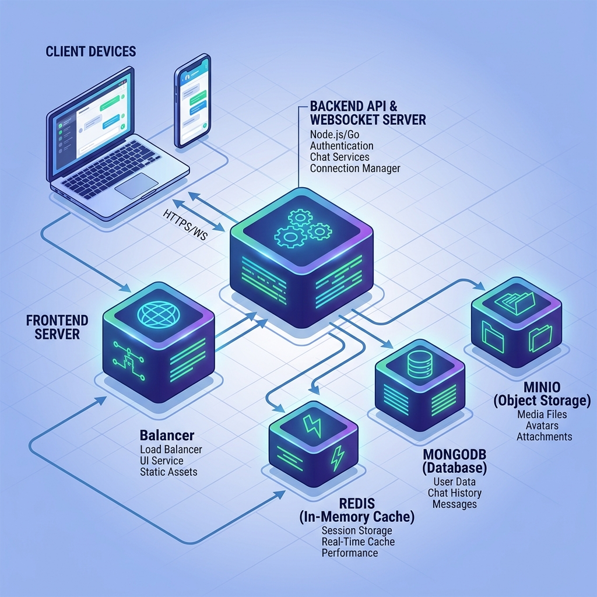
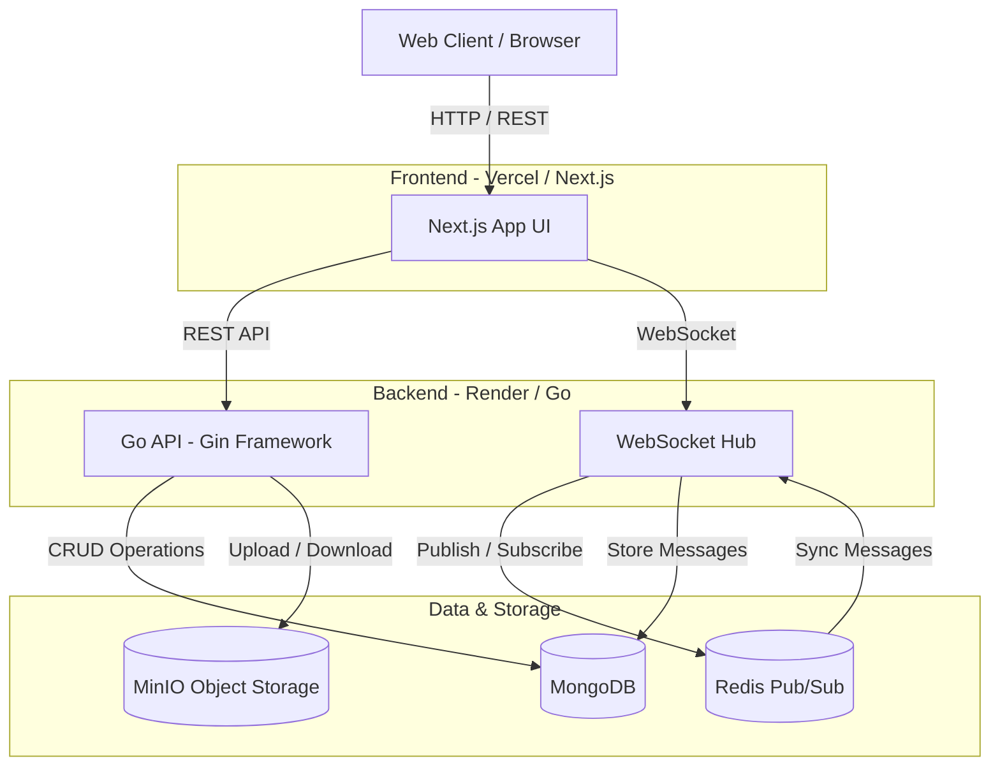
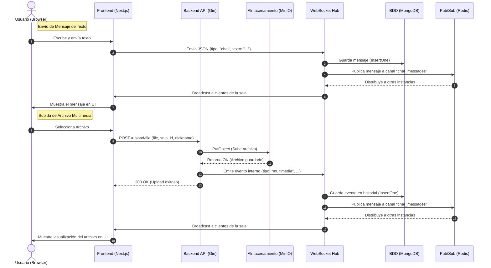

# 💬 Sistema de Chat Distribuido en Tiempo Real

Sistema de mensajería distribuida con soporte para salas de texto y multimedia, control de sesiones único por dispositivo (IP), almacenamiento de archivos en la nube con MinIO, y autenticación basada en JWT.

---

## 🏗️ Arquitectura

### Vista General (Contenedores)


### Diagrama de Flujo del Sistema


### Diagrama de Secuencias (Chat y Multimedia)


---

## ✨ Características Principales

### 🔒 Seguridad y Control de Sesiones
- **Auditoría de Seguridad Completa:** El sistema ha sido validado con herramientas de nivel industrial como **Gosec (SAST)**, **Gitleaks** y **k6 (DAST)**. Para más detalles, consulte el [Informe de Seguridad](docs/SECURITY_REPORT.md).
- **PINs Encriptados (Bcrypt):** Los PINs de las salas se almacenan y validan utilizando hashing con Bcrypt.
- **Sesión única estricta (DeviceID + IP):** El servidor bloquea con HTTP 409 cualquier intento de sesión duplicada utilizando un Canvas Fingerprint generado en el cliente, validación de IP local y estado de WebSockets en memoria (bloquea múltiples pestañas, modo incógnito y múltiples navegadores en una misma máquina).
- **JWT:** Autenticación basada en tokens para acceso a salas y subida de archivos.
- **Cabeceras de seguridad:** CSP, X-Frame-Options y X-Content-Type-Options configurados.
- **Sanitización de inputs:** Prevención de ataques XSS e IDOR en todos los endpoints sensibles.
- **Path Traversal:** Mitigado en la gestión de archivos usando `filepath.Base()`.

### 💬 Mensajería en Tiempo Real
- **WebSockets** para mensajes de texto e indicadores de escritura.
- **Salas de texto y multimedia** con PIN de acceso opcional.
- **Desconexión limpia:** Al cerrar la ventana/pestaña, el estado `activo` del usuario se libera automáticamente en la base de datos, permitiendo reconectarse desde el mismo dispositivo.
- **Broadcast** a todos los miembros de la sala activos.

### 📁 Almacenamiento de Archivos (MinIO)
- Subida segura de imágenes, documentos, audio, video y archivos comprimidos.
- Máximo de 100 MB por archivo.
- Los archivos se sirven directamente desde MinIO con `Content-Disposition` correcto.
- Vista previa de imágenes en el chat.

### 🖥️ Frontend (Next.js)
- Interfaz moderna con modo oscuro, glassmorphism y animaciones.
- Diseño completamente responsivo.
- Gestión de salas: crear, editar, eliminar y unirse con PIN.
- Sala de chat con indicador de escritura, panel lateral de usuarios y soporte de multimedia.

---

## 📁 Estructura del Proyecto

```
/
├── frontend-next/          # Frontend (Next.js 15 + React 19 + TailwindCSS)
│   └── src/
│       ├── app/            # Páginas: / (login), /home, /room/[id]
│       ├── components/     # Componentes reutilizables (RoomCard, ChatMessage, etc.)
│       ├── context/        # UserContext (estado global del usuario y deviceId)
│       └── types/          # Tipos TypeScript compartidos
│
├── internal/
│   ├── handlers/           # Handlers HTTP (Admin, Auth, Rooms, Upload)
│   ├── middleware/         # Auth, Rate Limiter y validaciones
│   ├── models/             # Estructuras de datos (Sala, Usuario, Mensaje)
│   ├── repository/         # Conexiones a Mongo, Redis y MinIO
│   ├── utils/              # JWT, Hashing y Cifrado de mensajes
│   └── websocket/          # Lógica del Hub y Clientes WebSocket
├── cmd/
│   └── api/                # Entry point (main.go)
└── docker-compose.yml      # Infraestructura: MongoDB, Redis, MinIO
```

---

## 🚀 Instalación y Ejecución

### Prerrequisitos
- [Go 1.21+](https://go.dev/dl/)
- [Node.js 20+](https://nodejs.org/)
- [Docker](https://www.docker.com/) (corriendo en WSL si usas Windows)

### 1. Levantar la Infraestructura (Docker)

```bash
# Desde WSL o Linux:
docker compose up -d
```

Esto levanta:
| Servicio  | Puerto Host | Descripción            |
|-----------|-------------|------------------------|
| MongoDB   | `27018`     | Base de datos principal |
| Redis     | `6380`      | Pub/Sub y caché        |
| MinIO     | `9191`      | Almacenamiento S3      |
| MinIO UI  | `9292`      | Consola web de MinIO   |

> **Credenciales MinIO por defecto:** user: `admin` / pass: `password123`

### 2. Backend (Go)

```bash
# En la raíz del proyecto
go mod tidy
go run main.go
```

El servidor queda disponible en `http://localhost:8080`.

### 3. Frontend (Next.js)

```bash
cd frontend-next
npm install
npm run dev
```

La interfaz queda disponible en `http://localhost:3000`.

---

## 🔌 API Endpoints Principales

| Método | Ruta                  | Descripción                                   |
|--------|-----------------------|-----------------------------------------------|
| POST   | `/rooms/create`       | Crear sala (requiere token Admin)             |
| GET    | `/rooms/list`         | Listar todas las salas                        |
| POST   | `/rooms/join`         | Unirse a sala (valida PIN + sesión única IP)  |
| PUT    | `/rooms/update`       | Actualizar sala (requiere token Admin)        |
| DELETE | `/rooms/delete`       | Eliminar sala (requiere token Admin)          |
| POST   | `/rooms/leave`        | Abandonar sala manualmente                    |
| GET    | `/ws?room=ID&device_id=X` | Conexión WebSocket a sala             |
| POST   | `/upload/file`        | Subir archivo multimedia                      |
| GET    | `/upload/file/:name`  | Descargar/ver archivo desde MinIO             |

---

## 🛡️ Lógica de Sesión Única y Restricción de Dispositivo

El sistema implementa una arquitectura de 3 capas para garantizar de forma estricta que un dispositivo físico (o un usuario) tenga **una sola sesión activa a la vez**, resolviendo problemas comunes como el uso de modo incógnito o múltiples navegadores simultáneos.

1. **Frontend (Canvas Fingerprinting):** En lugar de usar `localStorage` o APIs bloqueadas en modo incógnito, se utiliza Canvas Fingerprinting combinado con propiedades estáticas del hardware (CPU, RAM, Resolución) para generar un **DeviceID determinista** (`hw_XXXXX`) que identifica al navegador.
2. **Capa 0 (Triple validación en Hub):** Al intentar unirse a una sala o establecer el WebSocket, el servidor verifica instantáneamente en la memoria RAM si ya existe una conexión viva basándose en 3 factores: el **DeviceID**, la **Dirección IP** o el **Nickname**. Esto bloquea de inmediato:
   * Pestañas duplicadas (vía DeviceID).
   * Intentos de robar un nombre de usuario activo (vía Nickname).
   * Modo incógnito u otros navegadores abiertos en la misma máquina física (vía la IP local única del dispositivo).
3. **Capa 1 y 2 (Redis y MongoDB):** Si no hay un WebSocket vivo en memoria (ej. reconexión rápida), se valida el estado en Redis y en el índice único de MongoDB (`unique_active_device_id`). Si el dispositivo ya está marcado como activo, el servidor responde con **HTTP 409 Conflict**.
4. **Desconexión Limpia:** Al cerrar la ventana o salir de la sala, el servidor libera el dispositivo purificando Redis, el Hub en memoria y marcando `activo: false` en MongoDB, permitiendo reconectarse en el futuro sin bloqueos fantasma.

---

## 🧑‍💻 Credenciales de Prueba

| Usuario | Contraseña | Rol   |
|---------|------------|-------|
| Admin   | admin123   | Admin |

> Los usuarios regulares solo necesitan elegir un nickname al unirse a una sala.

